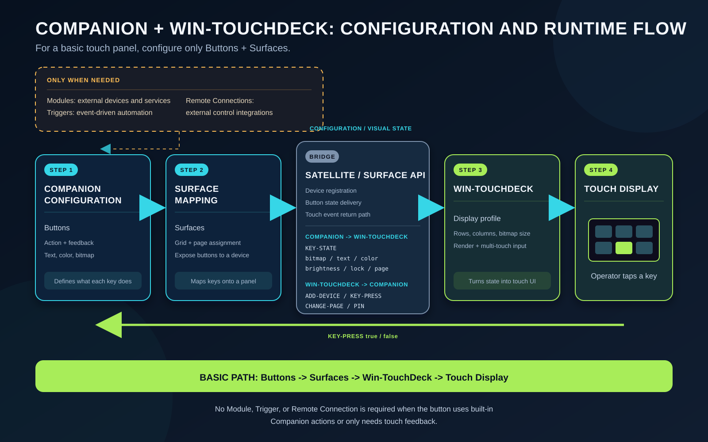

# Companion and Win-TouchDeck Usage Guide

## Why Buttons and Surfaces Are Enough

Win-TouchDeck behaves as a Companion Surface device. It does not need to become a Companion module and does not need a separate remote-control integration. Companion already provides a Surface protocol that delivers button state to a device and accepts touch events from that device.

For a basic touch panel, the required configuration path is:

1. **Buttons** define what each key displays and does.
2. **Surfaces** map those buttons and pages onto a device grid.
3. **Win-TouchDeck** registers a virtual Surface, renders the state sent by Companion, and returns touch events.
4. **The touch display** is only the physical input and output endpoint.

## Runtime Interaction

When Win-TouchDeck connects, it registers its device ID, grid dimensions, bitmap size, supported image format, page-navigation capability, and PIN-lock capability. Companion then sends button images, text, colors, pressed states, brightness, lock state, and page updates.

When an operator touches a key, Win-TouchDeck sends `KEY-PRESS` with `PRESSED=true`. Releasing the key sends the same key with `PRESSED=false`. Page navigation and PIN entry use their corresponding Surface protocol messages.

Win-TouchDeck therefore does not store or execute the business logic behind a button. Companion remains the source of truth for button actions and feedback; Win-TouchDeck is the presentation and input device.

## When the Other Companion Layers Are Needed

- **Modules** are needed when a button must control an external device or service, such as a switcher, camera, audio console, lighting system, or web API. The module supplies the actions and feedback that can be assigned to a button.
- **Triggers** are needed for event-driven automation that should run without a direct button press, such as responding to a variable, time, connection state, or another Companion event.
- **Remote Connections** are needed when an external application, system, or another Companion instance must control or integrate with Companion through a remote interface.

These capabilities can feed actions or feedback into Buttons, but they are optional branches. They are not part of the required communication path between a configured Companion Surface and Win-TouchDeck.

## Minimal Setup

1. Create the required actions and feedback on Companion Buttons.
2. Open Companion Surfaces and add or confirm the Win-TouchDeck Surface.
3. Assign the intended page and grid layout.
4. In Win-TouchDeck, set the Companion WebSocket address and select the target display.
5. Match the Win-TouchDeck rows, columns, and bitmap size to the Surface layout.
6. Connect and verify that button state appears, then test both press and release.
